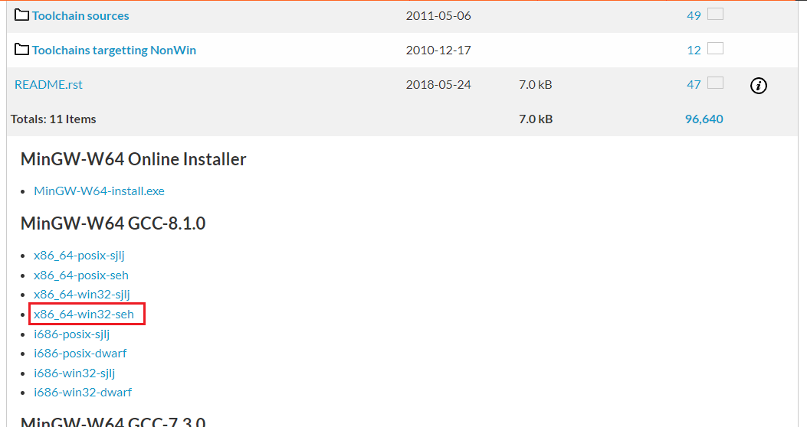
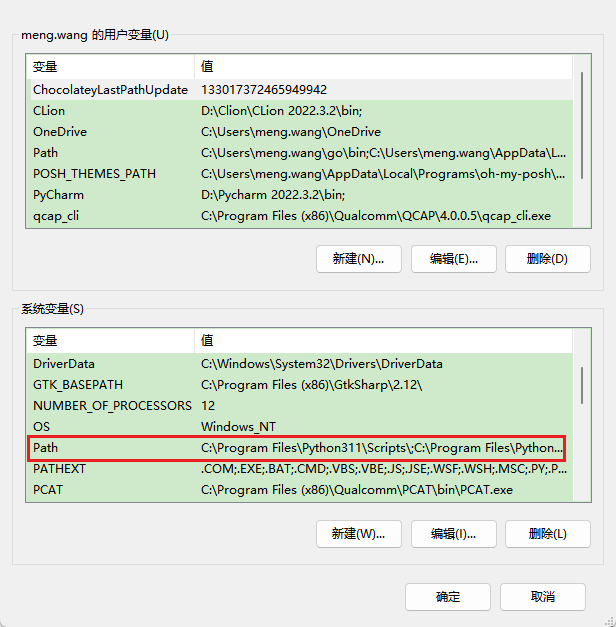
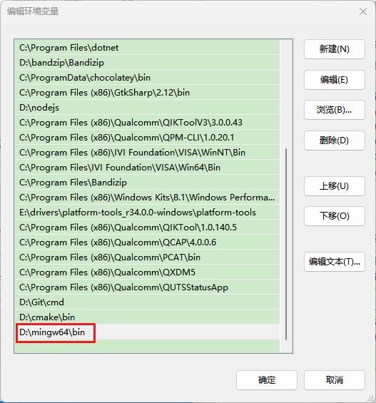
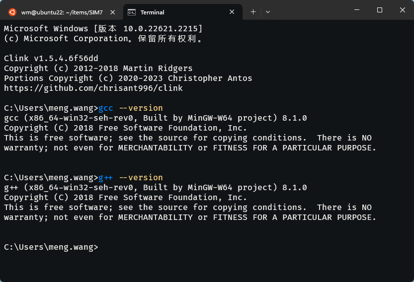

# 在 Win 环境下安装 MinGW-w64

访问 https://sourceforge.net/projects/mingw-w64/files/mingw-w64/mingw-w64-release/ 选择 MinGW-W64 GCC-8.1.0 Installer 下的 x86_64-win32-seh。

- GCC Version **默认最高**即可
- Architecture 电脑系统架构，32 位选择 **i686**，64 位选择 **x86_64**
- Threads 操作系统接口协议，开发 Linux、Unix、Mac OS 等系统下的程序选择 **posix**，开发 Win 系统下的程序选择 **win32**
- Exception 异常处理模型，**seh** 性能好，但仅支持 64 位系统。**sjlj** 比较古老，稳定性好，支持 32 位和 64 位系统。 



解压安装包，将解压目录下的 mingw64 剪切到你安装软件的常用目录。

接着添加环境变量，搜索 **编辑系统环境变量**，选择环境变量


打开**系统变量**的 **path** 选项



新建一环境变量，在浏览选项中选择你的 `mingw64/bin` 目录



然后点击确定 -> 确定 -> 确定，退出环境变量的编辑。

新建一终端，输入以下命令

``` bash
gcc --version
g++ --version
```



上报 `gcc` 和 `g++` 的版本信息则表示 MinGW-w64 安装成功 🌹🌹🌹。
