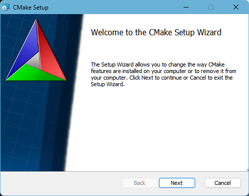
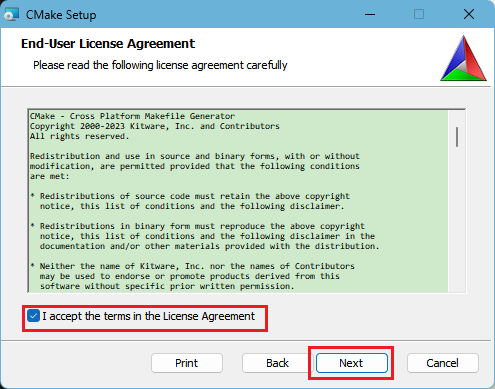
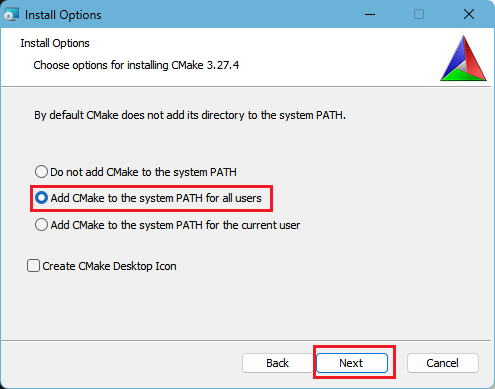
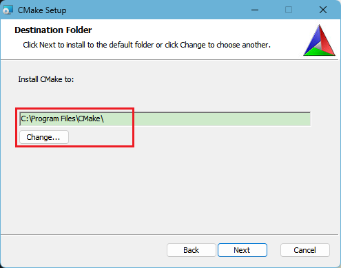
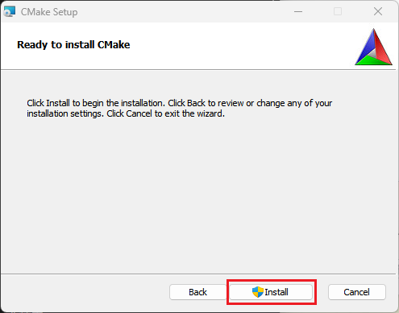
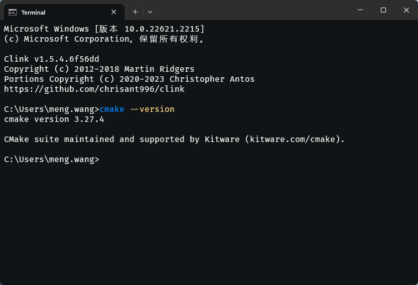

# 在 Win 环境下安装 CMake

打开网址 https://cmake.org/download/，找到 Win 系统 x64 平台的安装程序。

双击安装包，首页直接选择 `Next`



接受协议，然后 `Next`



选择 Add CMake to the system PATH for all users 意思是添加 CMake 到系统环境变量，对所有用户有效。当然你也可以选择第三项，只对当前用户有效。

创不创建 CMake 桌面图标看你自己，我不需要所以没有勾选。然后 `Next`



选择你的安装路径，然后 `Next`



选择 `Install`，等待安装。



安装完成后，新建一终端输入以下命令：

``` bash
cmake --version
```
命令上报 cmake 的版本信息，则表示安装成功 🌹🌹🌹。


