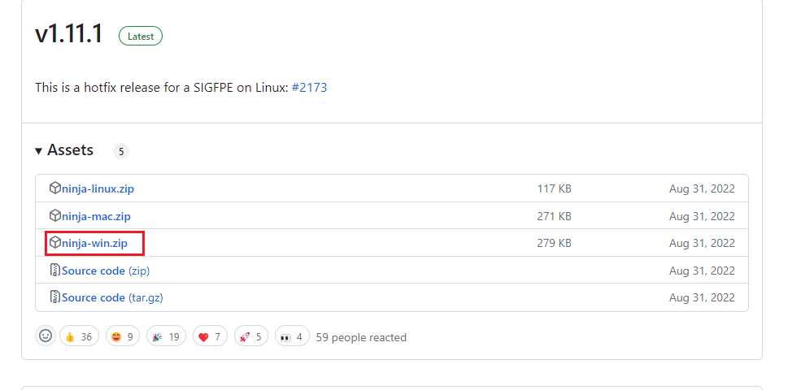
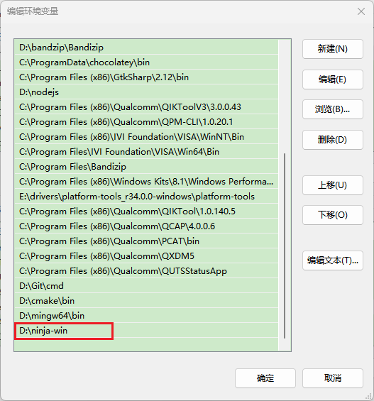
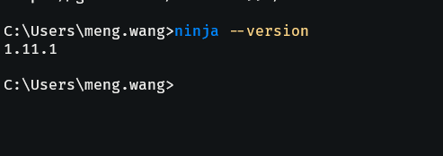

# 在 Win 环境下安装 Ninja

访问 Ninja 仓库的 releases https://github.com/ninja-build/ninja/releases，找到 ninja-win.zip，点击下载。



将下载的 Ninja 压缩包解压到安装应用的目录，而后在系统环境变量添加 ninja.exe 所在的目录。



执行以下命令：

``` bash
ninja --version
```

命令上报 ninja 的版本，则表示 ninja 安装成功 🌹🌹🌹。



