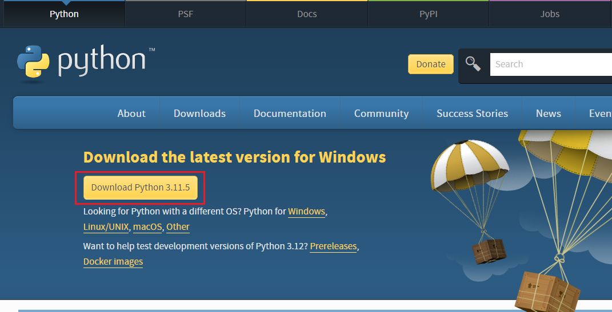
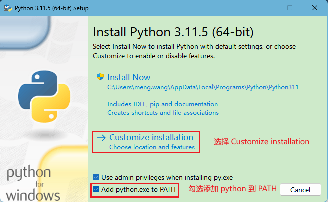
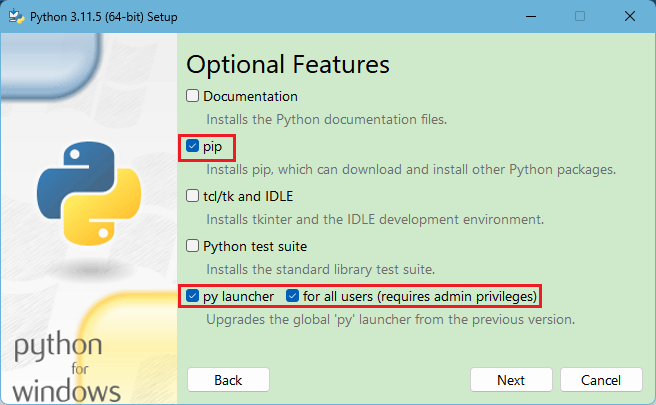
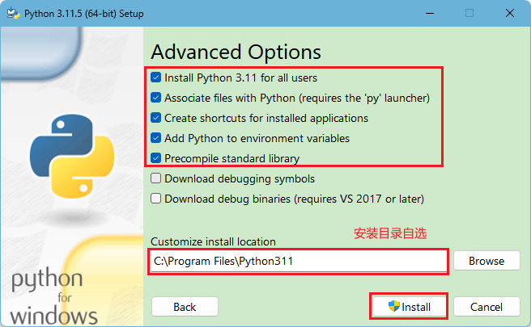

# 在 win 环境下安装 Python3

访问 https://www.python.org/downloads/，找到



点击 Download Python 3.11.5 (后续版本会更新)，等待网络的下载。

点击安装包，选择 `Customize installation` 自定义安装，并勾选上 Add python.exe to PATH。



按照如下所示勾选即可，勾选后选择 `Next`



安装如下所示勾选，勾选后选择 `Install`



安装完毕，打开终端输入

``` bash
python --version
Python 3.11.5
```

如果返回的是 python 的版本号则代表着安装成功 🌹🌹🌹。